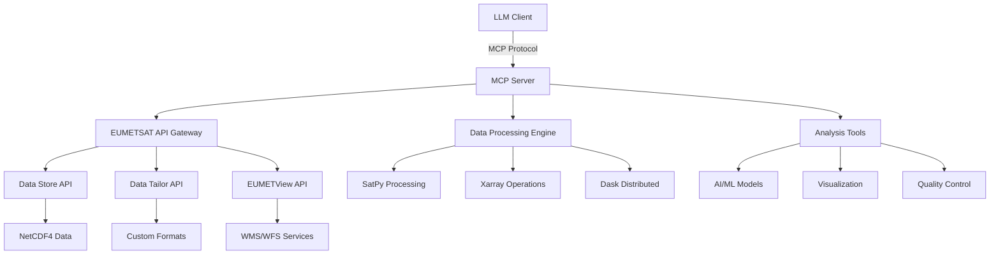

# weather-mcp-server
Proof of Concept (PoC) of MCP proxy server for  EUMETSAT's satellite data service catalog.

## Overview

This Proof of Concept (PoC) that integrates EUMETSAT's satellite data services with the Model Context Protocol (MCP), enabling AI-powered analysis and processing of meteorological satellite data. 

## 🎯 Objectives

- **Data Access Integration**: Seamless connection to EUMETSAT Data Store and Data Tailor APIs.
- **AI-Powered Analysis**: Leverage LLMs for intelligent satellite data interpretation.
- **Scientific Computing**: Integration with Python scientific ecosystem (xarray, dask, satpy).
- **Real-time Processing**: Support for streaming satellite data analysis.

## 🏗️ Architecture



## 🚀 Features

### Core Capabilities
- **Multi-format Data Support**: NetCDF4, HDF5, GRIB, BUFR, Zarr.
- **Intelligent Data Discovery**: AI-powered dataset recommendation and search.
- **Automated Processing**: ETL pipelines for satellite data transformation.
- **Real-time Analysis**: Stream processing for live satellite feeds.
- **Geospatial Analysis**: Advanced cartographic projections and mapping.
- **Quality Assurance**: Automated data validation and anomaly detection.

### MCP Tools Available
- `search_datasets`: Discover available satellite datasets.
- `search_products`: Find specific data products with temporal/spatial filters.
- `download_data`: Retrieve satellite data files.
- `process_data`: Apply transformations and analysis.
- `visualize_data`: Generate maps and visualizations.
- `analyze_quality`: Perform data quality assessment.

## 📋 Prerequisites

- Python 3.9+
- EUMETSAT API credentials (Consumer Key/Secret)
- Docker 


## 📁 Project Structure

TBD...

## 🔧 Configuration

TBD...

## 📊 Example Use Cases

### 1. Weather Pattern Analysis
```python
# Analyze weather patterns for specific region
analysis = client.weather_analysis(
    region="Canary Islands",
    parameters=["temperature", "humidity", "cloud_cover"],
    time_range="7 days"
)
```

### Development Guidelines

- Follow PEP 8 code style.
- Add tests for new features.
- Update documentation.
- Use semantic versioning.
- Write meaningful commit messages.

## 📄 License

This project is licensed under the MIT License - see the [LICENSE](LICENSE) file for details.

## 🙏 Acknowledgments

- **EUMETSAT** for providing satellite data services and APIs.
- **Model Context Protocol** community for the MCP specification.
- **Python Scientific Community** for the excellent ecosystem (xarray, dask, satpy).
- **PyTroll** community for meteorological data processing tools.

## 🗺️ Roadmap

TBD...

### Phase 1 (Current)
- [x] Basic MCP server implementation.
- [x] EUMETSAT API integration.
- [x] Core data processing tools.
- [ ] AI-powered analysis features.

---
